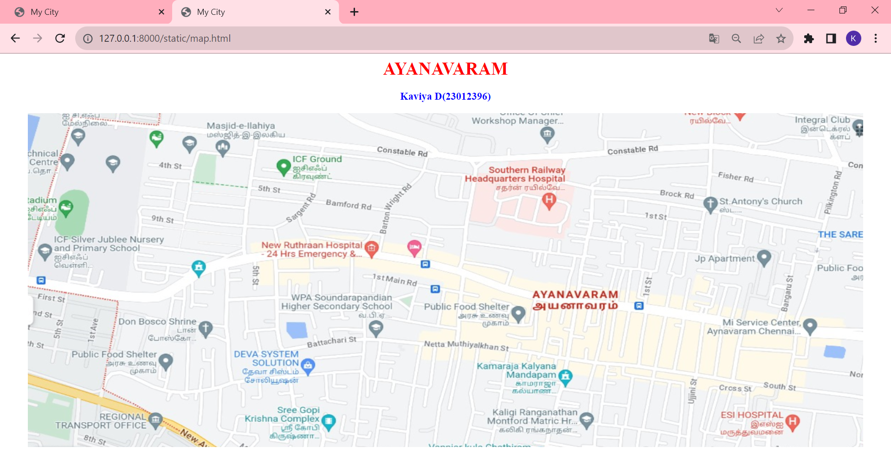
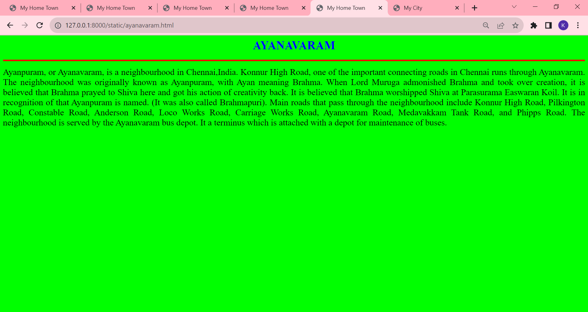
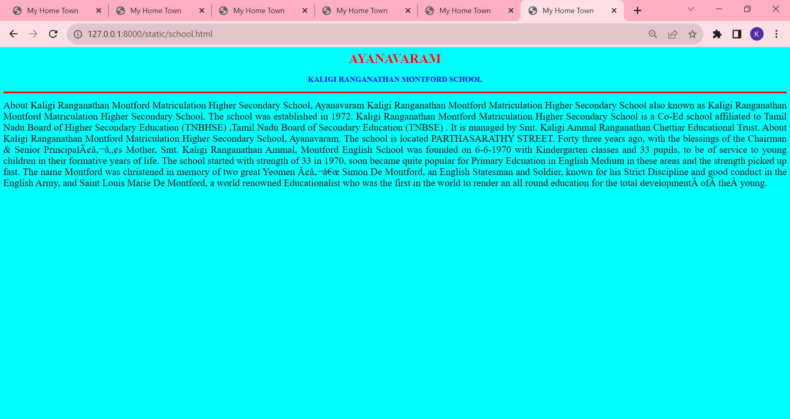
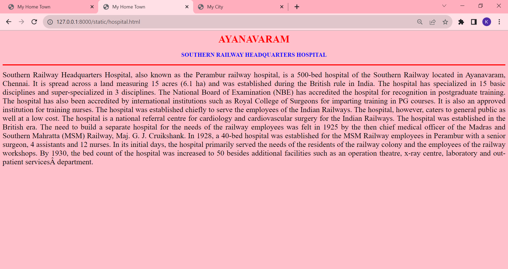
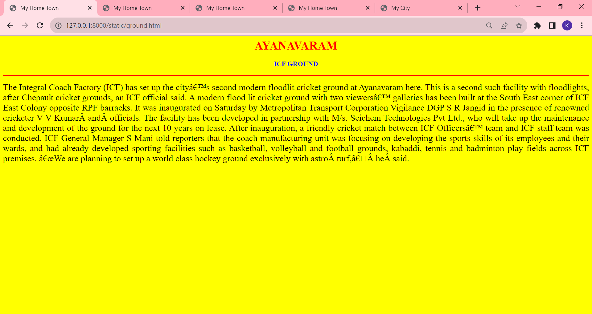
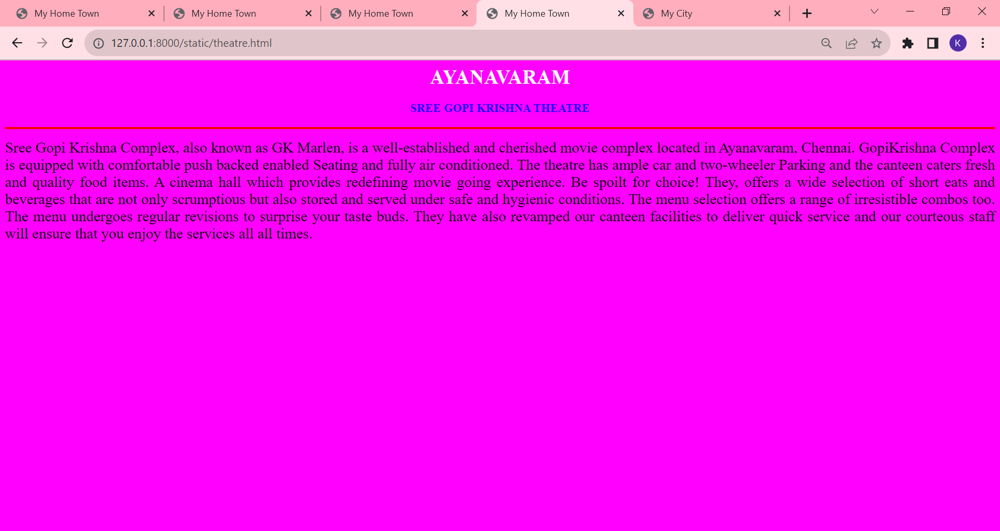
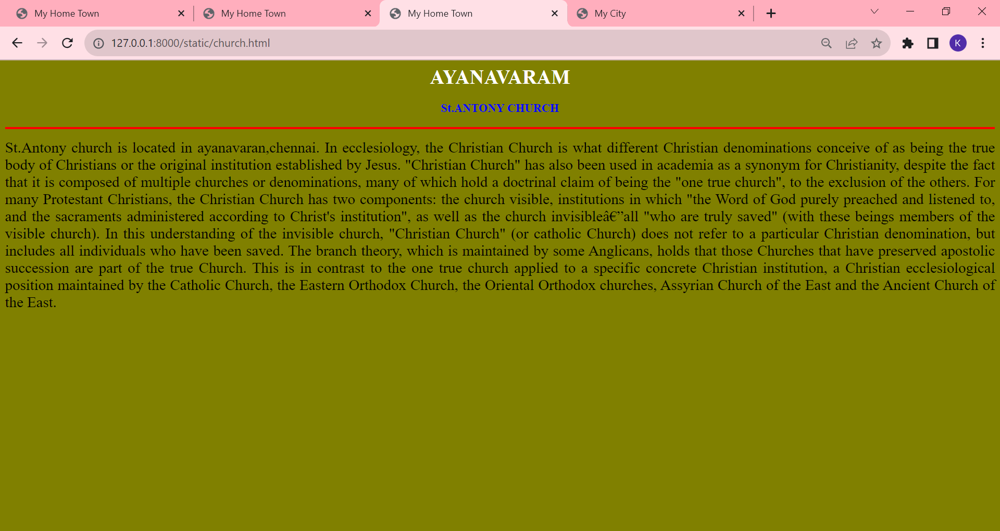

# Ex04 Places Around Me
## Date: 21/11/2023

## AIM
To develop a website to display details about the places around my house.

## DESIGN STEPS

### STEP 1
Create a Django admin interface.

### STEP 2
Download your city map from Google.

### STEP 3
Using ```<map>``` tag name the map.

### STEP 4
Create clickable regions in the image using ```<area>``` tag.

### STEP 5
Write HTML programs for all the regions identified.

### STEP 6
Execute the programs and publish them.

## CODE
```
map.html

<html>
<head>
<title>My City</title>
</head>
<body>
<h1 align="center">
<font color="red"><b>AYANAVARAM</b></font>
</h1>
<h3 align="center">
<font color="blue"><b>Kaviya D(23012396)</b></font>
</h3>
<center>

<map name="MyCity">
<area alt="Ayanavaram" title="Ayanavaram" href="ayanavaram.html" coords="891,353,1055,415" shape="rect">
<area alt="Southern Railway Headquarters Hospital" title="Southern Railway Headquarters Hospital" href="hospital.html" coords="768,86,985,207" shape="rect">
<area alt="ICF Ground" title="ICF Ground" href="ground.html" coords="431,76,570,150" shape="rect">
<area alt="Sree Gopi Krishna Complex" title="Sree Gopi Krishna Complex" href="theatre.html" coords="377,584,562,672" shape="rect">
<area alt="St.Antony's Church" title="St.Antony's Church" href="church.html" coords="1198,164,1378,217" shape="rect">
<area alt="Kaligi Ranganathan Montford School" title="Kaligi Ranganathan Montford School" href="school.html" coords="808,598,1011,660" shape="rect">
</map>
</center>
</body>
</head>
</html>
        
ayanavaram.html

<html>
<head>
<title>My Home Town</title>
</head>
<body bgcolor="lime">
<h1 align="center">
<font color="blue"><b>AYANAVARAM</b></font>
</h1>
<hr size="4" color="red">
<p align="justify">
<font face="Ayanavaram" size="5">
Ayanpuram, or Ayanavaram, is a neighbourhood in Chennai,India. 
Konnur High Road, one of the important connecting roads in Chennai runs through Ayanavaram.
The neighbourhood was originally known as Ayanpuram, with Ayan meaning Brahma. 
When Lord Muruga admonished Brahma and took over creation, it is believed that Brahma prayed to Shiva here and got his action of creativity back. 
It is believed that Brahma worshipped Shiva at Parasurama Easwaran Koil. 
It is in recognition of that Ayanpuram is named. (It was also called Brahmapuri).
Main roads that pass through the neighbourhood include Konnur High Road, Pilkington Road, Constable Road,
Anderson Road, Loco Works Road, Carriage Works Road, Ayanavaram Road, Medavakkam Tank Road, and Phipps Road. 
The neighbourhood is served by the Ayanavaram bus depot. It a terminus which is attached with a depot for maintenance of buses.
</font>
</p>
</body>
</html>

school.html

<html>
<head>
<title>My Home Town</title>
</head>
<body bgcolor="cyan">
<h1 align="center">
<font color="red"><b>AYANAVARAM</b></font>
</h1>
<h3 align="center">
<font color="blue"><b>KALIGI RANGANATHAN MONTFORD SCHOOL</b></font>
</h3>
<hr size="4" color="red">
<p align="justify">
<font face="Ayanavaram" size="5">
About Kaligi Ranganathan Montford Matriculation Higher Secondary School, Ayanavaram
Kaligi Ranganathan Montford Matriculation Higher Secondary School also known as Kaligi Ranganathan Montford Matriculation Higher Secondary School. 
The school was established in 1972. 
Kaligi Ranganathan Montford Matriculation Higher Secondary School is a Co-Ed school affiliated to Tamil Nadu Board of Higher Secondary Education (TNBHSE) ,Tamil Nadu Board of Secondary Education (TNBSE) .
It is managed by Smt. Kaligi Ammal Ranganathan Chettiar Educational Trust.
About Kaligi Ranganathan Montford Matriculation Higher Secondary School, Ayanavaram.
The school is located PARTHASARATHY STREET.
Forty three years ago, with the blessings of the Chairman & Senior Principal’s Mother, Smt. Kaligi Ranganathan Ammal, Montford English School was founded on 6-6-1970 with Kindergarten classes and 33 pupils, to be of service to young children in their formative years of life.
The school started with strength of 33 in 1970, soon became quite popular for Primary Edcuation in English Medium in these areas and the strength picked up fast. The name Montford was christened in memory of two great Yeomen – Simon De Montford, an English Statesman and Soldier,
known for his Strict Discipline and good conduct in the English Army, and Saint Louis Marie De Montford, a world renowned Educationalist who was the first in the world to render an all round education for the total development of the young.
</font>
</p>
</body>
</html>

hospital.html

<html>
<head>
<title>My Home Town</title>
</head>
<body bgcolor="pink">
<h1 align="center">
<font color="red"><b>AYANAVARAM</b></font>
</h1>
<h3 align="center">
<font color="blue"><b>SOUTHERN RAILWAY HEADQUARTERS HOSPITAL</b></font>
</h3>
<hr size="4" color="red">
<p align="justify">
<font face="Ayanavaram" size="5">
Southern Railway Headquarters Hospital, also known as the Perambur railway hospital, is a 500-bed hospital of the Southern Railway located in Ayanavaram, Chennai.
It is spread across a land measuring 15 acres (6.1 ha) and was established during the British rule in India.
The hospital has specialized in 15 basic disciplines and super-specialized in 3 disciplines. 
The National Board of Examination (NBE) has accredited the hospital for recognition in postgraduate training. 
The hospital has also been accredited by international institutions such as Royal College of Surgeons for imparting training in PG courses. 
It is also an approved institution for training nurses.
The hospital was established chiefly to serve the employees of the Indian Railways. 
The hospital, however, caters to general public as well at a low cost. 
The hospital is a national referral centre for cardiology and cardiovascular surgery for the Indian Railways.
The hospital was established in the British era. 
The need to build a separate hospital for the needs of the railway employees was felt in 1925 by the then chief medical officer of the Madras and Southern Mahratta (MSM) Railway, Maj. G. J. Cruikshank. 
In 1928, a 40-bed hospital was established for the MSM Railway employees in Perambur with a senior surgeon, 4 assistants and 12 nurses. 
In its initial days, the hospital primarily served the needs of the residents of the railway colony and the employees of the railway workshops. 
By 1930, the bed count of the hospital was increased to 50 besides additional facilities such as an operation theatre, x-ray centre, laboratory and out-patient services department.
</font>
</p>
</body>
</html>

ground.html

<html>
<head>
<title>My Home Town</title>
</head>
<body bgcolor="yellow">
<h1 align="center">
<font color="red"><b>AYANAVARAM</b></font>
</h1>
<h3 align="center">
<font color="blue"><b>ICF GROUND</b></font>
</h3>
<hr size="4" color="red">
<p align="justify">
<font face="Ayanavaram" size="5">
The Integral Coach Factory (ICF) has set up the city second modern floodlit cricket ground at Ayanavaram here. 
This is a second such facility with floodlights, after Chepauk cricket grounds, an ICF official said.
A modern flood lit cricket ground with two viewers galleries has been built at the South East corner of ICF East Colony opposite RPF barracks.
It was inaugurated on Saturday by Metropolitan Transport Corporation Vigilance DGP S R Jangid in the presence of renowned cricketer V V Kumar and officials.
The facility has been developed in partnership with M/s. Seichem Technologies Pvt Ltd., who will take up the maintenance and development of the ground for the next 10 years on lease. After inauguration, a friendly cricket match between ICF Officers’ team and ICF staff team was conducted.
ICF General Manager S Mani told reporters that the coach manufacturing unit was focusing on developing the sports skills of its employees and their wards,
and had already developed sporting facilities such as basketball, volleyball and football grounds, kabaddi, tennis and badminton play fields across ICF premises.
</font>    
</p>
</body>
</html>

theatre.html

<html>
<head>
<title>My Home Town</title>
</head>
<body bgcolor="fuchsia">
<h1 align="center">
<font color="white"><b>AYANAVARAM</b></font>
</h1>
<h3 align="center">
<font color="blue"><b>SREE GOPI KRISHNA THEATRE</b></font>
</h3>
<hr size="4" color="red">
<p align="justify">
<font face="Ayanavaram" size="5">
Sree Gopi Krishna Complex, also known as GK Marlen, is a well-established and cherished movie complex located in Ayanavaram, Chennai.
GopiKrishna Complex is equipped with comfortable push backed enabled Seating and fully air conditioned. 
The theatre has ample car and two-wheeler Parking and the canteen caters fresh and quality food items. 
A cinema hall which provides redefining movie going experience.
Be spoilt for choice! They, offers a wide selection of short eats and beverages that are not only scrumptious but also stored and served under safe and hygienic conditions. 
The menu selection offers a range of irresistible combos too. 
The menu undergoes regular revisions to surprise your taste buds. 
They have also revamped our canteen facilities to deliver quick service and our courteous staff will ensure that you enjoy the services all all times.
</font>
</p>
</body>
</html>

church.html

<html>
<head>
<title>My Home Town</title>
</head>
<body bgcolor="olive">
<h1 align="center">
<font color="white"><b>AYANAVARAM</b></font>
</h1>
<h3 align="center">
<font color="blue"><b>St.ANTONY CHURCH</b></font>
</h3>
<hr size="4" color="red">
<p align="justify">
<font face="Ayanavaram" size="5">
St.Antony church is located in ayanavaran,chennai.
In ecclesiology, the Christian Church is what different Christian denominations conceive of as being the true body of Christians or the original institution established by Jesus. 
"Christian Church" has also been used in academia as a synonym for Christianity, despite the fact that it is composed of multiple churches or denominations, many of which hold a doctrinal claim of being the "one true church", to the exclusion of the others.
For many Protestant Christians, the Christian Church has two components: the church visible, institutions in which "the Word of God purely preached and listened to, and the sacraments administered according to Christ's institution", as well as the church invisible—all "who are truly saved" (with these beings members of the visible church).
In this understanding of the invisible church, "Christian Church" (or catholic Church) does not refer to a particular Christian denomination, but includes all individuals who have been saved.
The branch theory, which is maintained by some Anglicans, holds that those Churches that have preserved apostolic succession are part of the true Church. 
This is in contrast to the one true church applied to a specific concrete Christian institution, a Christian ecclesiological position maintained by the Catholic Church, the Eastern Orthodox Church, the Oriental Orthodox churches, Assyrian Church of the East and the Ancient Church of the East.
</font>
</p>
</body>
</html>

```

## OUTPUT












## RESULT
The program for implementing image maps using HTML is executed successfully.
